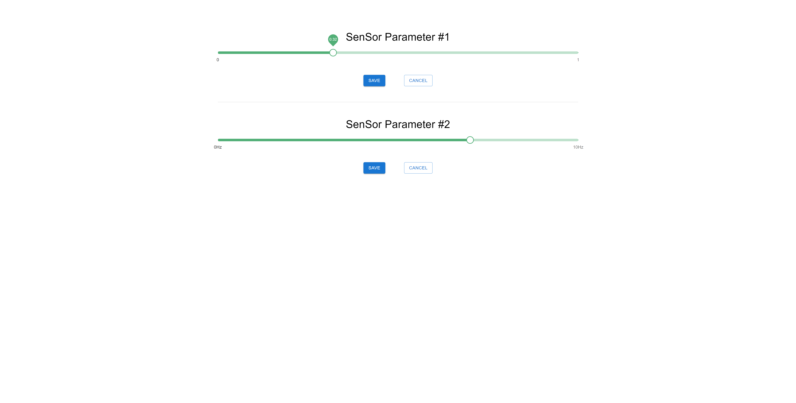

# Chanllenge description
1. Submit a piece of front-end code for which you are the sole author. This can be from a previous work project (subject to any necessary business anonymization), a personal project, or something written specifically for this assessment. An ideal submission will illustrate:
    + Conformance to good programming practices
    + Some level of creativity or ingenuity
    + Some measure of applicability to the types of web interfaces discussed with Numurus for the NEPI product line
    The submission does not need to be a complete, runnable application, but should be a well-formed module with an obvious purpose. You may submit a written paragraph describing the purpose of the submitted code and any other details helpful to assess its quality.
2. Consider the following scenario: A web-based user interface must communicate with a back-end sensor controller to set a floating point parameter value in the range 0.0 to 1.0 on the sensor hardware, which it accomplishes by way of a mouse-controlled element (e.g., slider bar). Upon receipt, the sensor controller may accept or reject the parameter based on conditions unknown to the front-end. The back-end cannot service parameter update requests faster than 10Hz. The current value of the parameter is published by the sensor controller after each attempted update, whether success or failure, and also at a fixed 1Hz frequency. Describe a front-end design that accomplishes the objective.

You may describe your solution in words or submit a code snippet that clearly illustrates your solution and for which you are the sole author. If submitting code, the code need not be a complete runnable application; it is permissible to use clearly named or commented function calls that are not implemented, particularly for abstracted front-end/back-end communications. A code snippet submission for #2 can also serve as a submission for #1.

# Structure
 - `assessment-1` directory is code snippet of my previous React project and not fully working.
 - `assessment-2` directory describes my solution for 2nd task, the relationship between frontend and backend controller to update some sensor parameters.

├── assessment-1 <br />
│   ├── conainers <br />
│   │   ├── content <br />
│   │   ├── hoc <br />
│   │   ├── sidebar <br />
│   │   ├── ace-editor.jsx <br />
│   │   └── app.jsx <br />
│   │   └── editor-js.jsx <br />
│   │   └── layout.jsx <br />
│   │   └── theme-switcher.jsx <br />
├── assessment-2 <br />
│   ├── backend <br />
│   │   └── business <br />
│   │   └── data-layer <br />
│   │   └── presentation <br />
│   │   └── docker-compose.yml <br />
│   │   └── Dockerfile <br />
│   │   └── package.json <br />
│   │   └── server.js <br />
│   ├── frontend <br />
│   │   └── public <br />
│   │   └── src <br />
│   │   └── package.json <br />
│   │   └── README.md <br />
│   │   └── package.json <br />
│   │   └── tsconfig.json <br />

# Solution description

## Assessment 1
- Conformance to good programming practices
  * This code was written with general principles of programming include SOLID principle and OOP.
- Some level of creativity or ingenuity
  * According to the ui layout design, it divides the entire layout to a sidebar container and content container and made all possible sub-contents element as single component.
  * Each component was well-modularized with their props and methods and used the most optimized structure in a smallest line counts.
- Some measure of applicability to the types of web interfaces discussed with Numurus for the NEPI product line
  * Every single frontend element were all components. And each component was structured with its ui props and actions so are ready to be customizable both its visual being and its placement.
    So if a user drag and drop a component, there shoud be action that represents drag-and-drop so that that action will be triggered when user drags and drops it.
    After a certain action is triggered, its update its view/layout/appearance and finally those values will be stored on backend database.

## Assessment 2

Here we have 2 params - sensor1 variant is changing from 0 to 1 and sensor2 variant is changing from 0 to 10Hz.
They are both controlled by slider bar on frontend. There can be 3 parameters to describe those sensor variants update component - title, slidebar and action buttons to save and cancel.
So we can make make single component that has these 3 parameters as component props sth like this.

```
<SensorUpdate title={sensorVariantTitle} range={sensorVariantRange} />
```

After clicking `save` button on a sensor variant component, it will call an `POST` api on backend with request body `{ sensorVariantName: 'variant1', sensorVariantValue: 'x.x' }` and display the result with notification panel component.

## Script to run

```
$ cd assessment-2/frontend
$ npm start 
```

## Final view
The final view of frontend page looks like this. (Didn't implemented some features like route definition on frontend due to lack of time)



